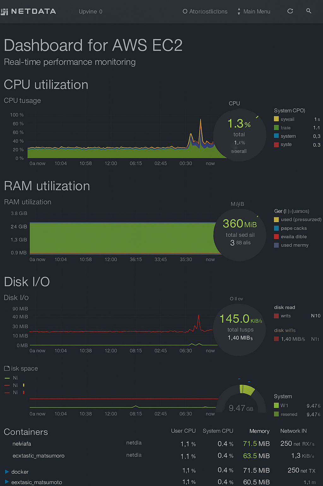

 Monitor System Resources Using Netdata

 Objective
To set up Netdata on an AWS EC2 server using Docker and monitor system performance metrics like CPU, RAM, disk I/O, and Docker containers in real time.


  🛠 Tools & Technologies Used
- Netdata  – Lightweight monitoring tool
-  Docker – To run Netdata easily
-  AWS EC2 (Amazon Linux 2)  – Cloud server for hosting
-  Web Browser  – For viewing the Netdata dashboard


 🚀 What I Did (Step-by-Step)

1.  Connected to AWS EC2 instance using SSH.
2.  Installed Docker** on the server.
3. Pulled and ran the Netdata Docker container using this command:

   ```bash
   docker run -d --name=netdata \
     -p 19999:19999 \
     --cap-add=SYS_PTRACE \
     --security-opt apparmor=unconfined \
     netdata/netdata

4. Opened port 19999** in the EC2 security group to allow external access.

5. Accessed the Netdata dashboard via browser at:

   ```
   http://<your-ec2-public-ip>:19999
   ```

6. Monitored:

     CPU usage
     RAM utilization
     Disk activity
     Docker container stats

7. Took a screenshot of the live dashboard and saved it in the `screenshot/` folder.


   Screenshot

Below is the Netdata dashboard running on the EC2 server:



It shows live metrics like CPU usage, RAM, disk activity, and Docker container stats.


It shows live metrics like CPU usage, RAM, disk activity, and Docker container stats.


 ✅ Outcome

 Successfully set up Netdata on an AWS EC2 server.
 Gained hands-on experience in using Docker to deploy monitoring tools.
 Understood how to track live performance data on servers and containers.


 📂 Folder Structure


task-7-netdata-monitoring/
│
├── screenshot/
│   └── netdata-dashboard.png
│
└── README.md 


